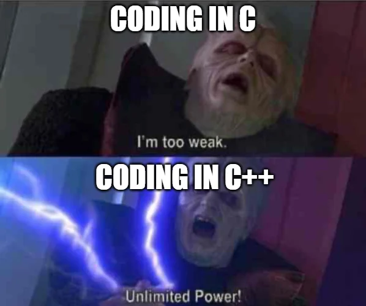
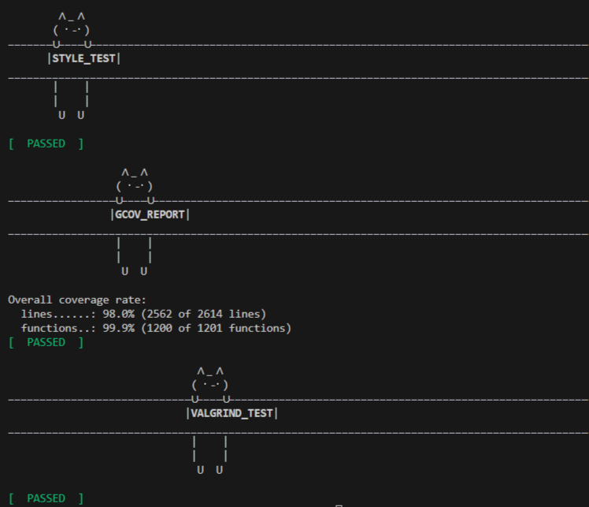

# -containers- 

Код находится в отдельном [репозитории](https://github.com/karnaksp/-containers-/tree/main/src).

Групповой проект для реализации stl c++ контейнеров.

На шестой день отец программирования подумал о контейнерах и решил, что они хороши...

Эта библиотека была разработана с нуля выходцами из языка C, но, к сожалению, не за 6 дней, а за месяц и вкдючает следующие контейнеры: `list` (список), `map` (словарь), `queue` (очередь), `set` (множество), `stack` (стек) и `vector` (вектор).



## Информационное вступление

Контейнеры - это как коробки, в которые вы складываете свои игрушки, но в мире C++. Вот вам аналогия: представьте, что у вас есть коробки для хранения всего на свете. Но эти коробки разные: одни для книжек (вектор), другие для уникальных коллекционных фигурок (множество), а третьи для быстрого доступа к конфетам по имени (словарь). Каждый контейнер обладает уникальными суперсилами и идеально подходит для разных задач.

### Коробочные суперы


- **List**: Настоящий акробат, позволяет легко вставлять и удалять элементы в любом месте. В нашем случае - цирковой артист, который держит баланс в любой ситуации.
- **Map**: Великий хранитель пар "ключ-значение". Как библиотекарь, который всегда знает, где лежит нужная книга.
- **Queue**: Организованный как очередь за хот-догами на стадионе - обслуживает первого пришедшего.
- **Set**: Как элитный клуб - здесь только уникальные элементы. Никаких повторов, только эксклюзив!
- **Stack**: Магическая шляпа фокусника - достаешь то, что положил последним.
- **Vector**: Массив на стероидах - быстрый доступ к любому элементу и динамическое расширение по мере необходимости.

### Итераторы

Итераторы - это маленькие помощники, которые помогут вам обойти все ваши контейнеры. Они как указатели на место в книге, которые показывают вам, где находится нужный элемент. Вы можете перемещать их вперед, назад и даже сравнивать друг с другом. 

Итераторы поддерживают следующие трюки:

- `*iter`: Получить элемент, на который указывает итератор.
- `++iter`: Перейти к следующему элементу.
- `--iter`: Вернуться к предыдущему элементу.
- `iter1 == iter2`: Проверить, указывают ли итераторы на один и тот же элемент.
- `iter1 != iter2`: Убедиться, что итераторы указывают на разные элементы.

### Шаблоны

Наши контейнеры написаны с использованием шаблонов, чтобы вы могли хранить любые типы данных, будь то целые числа, строки или даже ваши собственные классы. Просто представьте, что наши контейнеры - это волшебные сундуки, которые принимают любую форму, в зависимости от того, что вы в них кладете.

### Детали реализации

- **Язык программирования**: C++17.
- **Компилятор**: gcc.
- **Организация кода**: Все драгоценные исходники спрятаны в папке `src`.
- **Стиль кода**: Чистый и красивый, как по учебнику Google Style.
- **Использование итераторов**: Это обязательно, потому что зачем же иначе писать контейнеры?
- **Шаблонные классы**: Все классы - мастера перевоплощения (шаблонные).
- **Пространство имен**: `s21` - наше гордое имя.
- **Unit-тестирование**: Каждому контейнеру - свою порцию тестов, все сделано с помощью библиотеки GTest.
- **Запрещено**: Копирование реализаций STL. Мы любим вызовы и оригинальность.

## Реализация библиотеки s21_containers.h

Наша библиотека `s21_containers.h` включает реализацию всех основных контейнеров: `s21_list.h`, `s21_map.h`, `s21_queue.h`, `s21_set.h`, `s21_stack.h`, `s21_vector.h`. 

### Основные классы

- **List**: Реализован через структуру двусвязного списка, поддерживает двунаправленные итераторы. Это наш цирковой артист!
- **Map**: Ассоциативный контейнер, использующий красно-черное дерево для хранения пар "ключ-значение". Ловкий библиотекарь, хранящий книги.
- **Queue**: Последовательный контейнер для хранения элементов в порядке их добавления. Очередь за хот-догами!
- **Set**: Множество уникальных элементов, использующее красно-черное дерево. Элитный клуб уникальных элементов.
- **Stack**: Последовательный контейнер, реализующий принцип LIFO. Магическая шляпа фокусника.
- **Vector**: Динамический массив, поддерживающий прямой доступ по индексу. Массив на стероидах!

### Реализация красно-черного дерева

Для реализации `map` и `set` мы использовали [красно-черное дерево](https://github.com/karnaksp/-containers-/tree/main/src/rb-tree/s21_tree.h), обеспечивающее балансировку и эффективные операции вставки, удаления и поиска. Вот некоторые ключевые моменты:

```cpp
template <class K, class Compare = std::less<K>>
class RBTree {
 public:
  using key_type = K;
  using tree_node = s21::Node<key_type>;
  using iterator = s21::Iterator<key_type>;

  RBTree() : head_(new tree_node), size_(0){};
  ~RBTree();

  iterator TreeBegin() noexcept;
  iterator TreeEnd() noexcept;
  std::pair<iterator, bool> Insert(const key_type &key);
  void TreeClear();

 private:
  tree_node *head_;
  size_t size_;
  Compare less_;
  bool flag_uniq = true;

  tree_node *&root_() const;
  bool IsRed(tree_node *node);
  tree_node *FixUp(tree_node *node);
  tree_node *RotateLeft(tree_node *node);
  tree_node *RotateRight(tree_node *node);
  tree_node *Insert(tree_node *node, tree_node *Parent, const key_type &key,
                    std::pair<iterator, bool> &pair_res);
};
```

### Makefile

Мы не забыли про Makefile, чтобы вы могли легко собрать и протестировать библиотеку. Поддерживаемые цели:

- `clean`: Очистка всех временных файлов, потому что чистота - залог здоровья.
- `test`: Запуск всех unit-тестов, чтобы убедиться, что всё работает как часы.
- `gcov_report` и `open_report`: Проверка покрытия функциональности библиотеки тестами. Чтобы не сочинять лишнего.
- `all`: Запускает все цеели с котятами.



## Итог

Библиотека `s21_containers` - это наше погружение в мир C++. Она предоставляет вам мощные и гибкие инструменты для работы с данными, а полное покрытие unit-тестами гарантирует надежность и стабильность. 


Скачивайте, используйте, вносите свои предложения и улучшения. Пусть ваши контейнеры будут быстрыми, а код - красивым!

