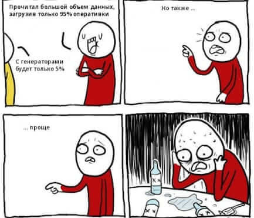

# Интенсив по Python в школе 21


Каждый день интенсива сопровождается `makefile`'ом, в котором есть набор целей для сборки и тестирования (unittest, pytest, coverage), сборки и установки зависимостей а так же линтинга. 

Кроме того, в makefile есть цель для сборки всего проекта в `docker` и запуска его в командной строке, чтобы можно было протестировать все, не отходя от кассы: 


* make Ex00 - запуск программы или тестов
* make get_req - парсинг пакетов
* make install_req - установка пакетов
* make install_dep - установка зависимостей
* make check_style - запуск линтеров
* make run_in_docker - запуск в докере

Весь этот проект ваш будет сопровождать котик, чтобы беречь вашу менталку и ограничивать выводы консоли. а чтобы совсем почистить все лишние можно выполнить 
```bash
make clean
```


> day 00 

Здесь и далее старался делать raise для как можно более конкретных ошибок, а помогал в этом такой опупенский [читшит](https://kieranholland.com/best-python-cheat-sheet/). Покрыл тестами этот день через bash скрипты, передавая тестовые файлы и сравнивая результат. Полученные навыки: списочек ошибок, задания на подумоть развивают логику.


> day 01

В этом дне поработали с `dic*t'ами`, сделали акцент на то, чтобы не изменять изменяемый тип данных. Заставили sys передавать модули из одного задания в другое. Много внимания уделили типизации и написали свой собственный декоратор wrapper! Протестировал все, используя `unittest`, используя `assertEqual`, `assertIn` и `assertRaises`, а так же пропатчили `stdout`, чтобы вывод попадал в тесты.


> day 02

Поработал над магическими методами, чтобы избежать призраков фоллаута. Немножко затронули наследуемость и воспроизвели диллему заключенного, выяснив, что стратегия зуб за зуб наиболее успешная в этой игре. Так же документирвоал код в стиле `scipy`.


> day 03

В этом дне почувствовали себя хакерами, подменив содержимое html страницы на "хакнутое" содержимое с поддельными ссылками и парсингом личных данных! Потрогали библиотеку `BeautifulSoup`, связь `html` и `js`, `Redis` и концепцию producer - consumer в транзакциях. Настроили автоматическую генерацию файла `yml` для `ansible`. 


> day 04

Разобрались с созданием итераторов и генераторов и наконец поняли как и где использовать это `yield`. Это помогло регулирвоать давление в оптимальном окне или экстренно завершать работу при достижении больших показателей. Разобрались, как динамически генерирвоать классы при помощи `type`. Патчили `@patch` функцию `random` в тестах, чобы выдавала нужные результаты! 


______________________________
Отдых и отсылка на следующий командный день

______________________________
