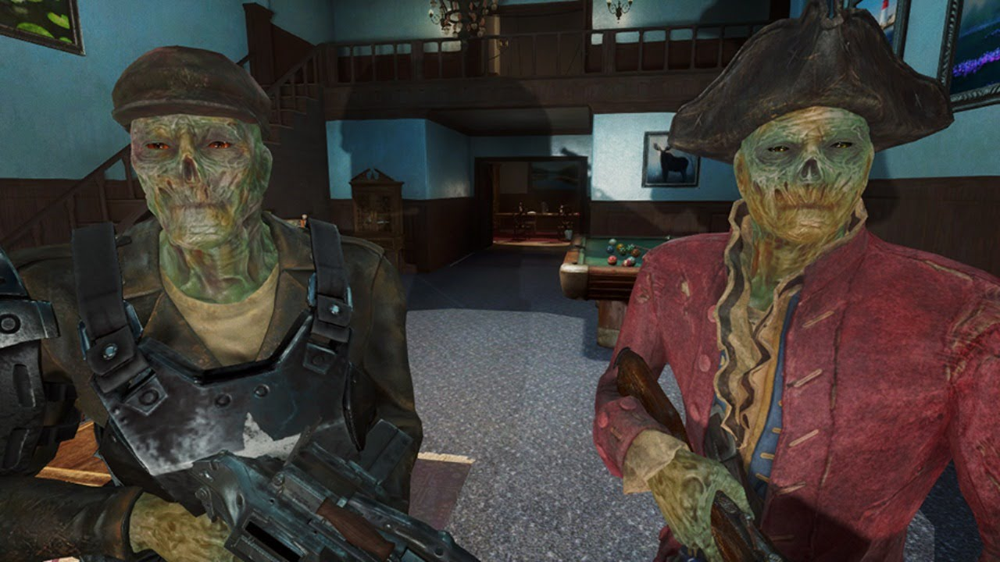

# Day 02 - Python Bootcamp

Мир Фоллаут, аппокалипсис, мы ломаем двери ради безопасности.

> Exercise 00: Gaining Access

Создайте класс `Key`, чтобы экземпляр этого класса мог проходить проверки, описанные в задаче:
```
AssertionError: len(key) == 1337
AssertionError: key[404] == 3
AssertionError: key > 9000
AssertionError: key.passphrase == "zax2rulez"
AssertionError: str(key) == "GeneralTsoKeycard"

```
Необходимо реализовать магические методы и избежать создания `Key` размером 404 или меньше.

> Exercise 01: Morality

Реализовать систему из семи классов: `Game`, `Player` и пять типов поведения, моделирующих "дилемму заключенного". 

Игра должна симулировать матчи между игроками с разными типами поведения и выводить топ-3 лучших по результатам. Они пойдут в качестве корма гулям.

> Reading and Tips

Изучил наследование классов и использование `super()` в Python. Понял разницу между конструкторами (`__new__` и `__init__`) и их использованием.
